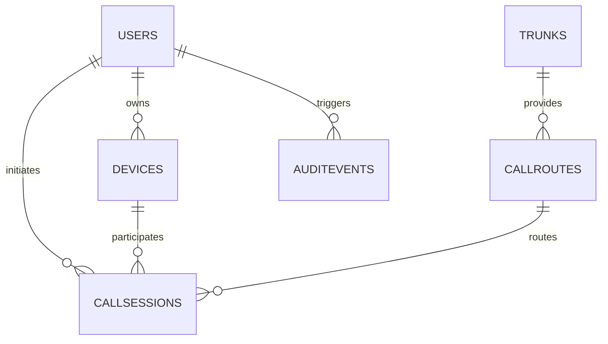

# Modèle de Données

## 1. Schémas Principaux
- **Users** : comptes agents/administrateurs.
- **Devices** : terminaux SIP associés (softphone, téléphone IP, gateway analogique).
- **Trunks** : connexions opérateurs ou interconnexions.
- **CallRoutes** : règles de routage (priorité, calendrier, file d'attente).
- **CallSessions** : journalisation des appels, métadonnées (Call-ID, timestamps, codecs, QoS).
- **AuditEvents** : journal des actions administratives.

## 2. Schéma Relationnel (simplifié)

- `users(id, email, role, status, created_at, updated_at)`
- `devices(id, user_id, sip_uri, auth_username, auth_secret, type, status)`
- `trunks(id, provider, sip_uri, status, capacity, failover_order)`
- `call_routes(id, name, priority, strategy, trunk_id, schedule_id)`
- `call_sessions(id, call_id, caller, callee, route_id, codec, started_at, ended_at, outcome, recording_path)`
- `audit_events(id, user_id, action, entity, metadata, created_at)`

## 3. Stockage Série Temporelle
- **Call Metrics** (TimescaleDB) : `call_metrics(call_session_id, jitter_avg, packet_loss, mos, interval)`.
- **Usage Stats** : consommation par trunk pour facturation.

## 4. Cache & Données Éphémères
- Redis stocke les sessions en cours (`SESSION:<Call-ID>`), tokens d'accès, throttle.
- TTL configurable (par défaut 15 min après fin de session).

## 5. Conformité Données
- Chiffrement au repos : colonnes sensibles (`auth_secret`, `recording_path`).
- Retention : call_sessions 12 mois, audit_events 24 mois, enregistrements 6 mois (ajustable).
- Anonymisation : données exportées pour analytics passent par pipeline de pseudonymisation.

Documenter toute évolution du schéma via migration (Flyway/Liquibase) et ADR.
