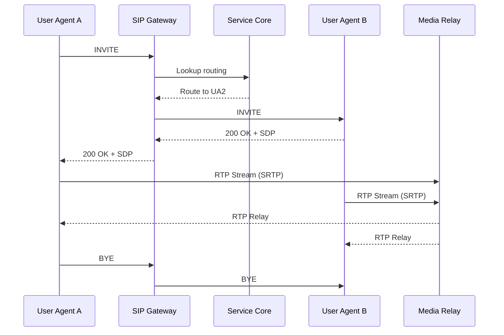

# Vue d'Ensemble

## 1. Composants Principaux
- **SIP Gateway** (`src/signalling`) : proxy/registrar SIP gérant REGISTER, INVITE, maintien de session, intégration avec le moteur de routage. Implémentation 100 % Rust (bibliothèque `rvoip`, runtime `tokio`, exposition `axum`). Kamailio reste en option de secours si un protocole critique manque.
- **Media Relay** (`src/media`) : composant RTP (RTPengine ou pipeline Rust basé sur GStreamer-rs) assurant la négociation codec, chiffrement SRTP, enregistrement optionnel.
- **Service Core** (`src/core`) : services partagés (authentification, configuration, gestion des sessions, orchestrations workflows) en Rust (`tokio`, `sqlx`, `redis-rs`).
- **API Platform** (`src/api`) : APIs REST/gRPC exposant provisioning, reporting, intégrations tierces via `axum`/`actix-web` et `tonic`.
- **Observability Stack** : Prometheus, Grafana, Loki, Tempo; collecteurs d'événements et dashboards.
- **Data Layer** : PostgreSQL, Redis, object storage (MinIO/S3), message broker (NATS/Kafka) pour les événements asynchrones.

## 2. Flux d'Appels (résumé)
1. Le terminal SIP envoie un `REGISTER` au SIP Gateway.
2. Le Gateway valide l'identité via le Service Core (OAuth/LDAP) puis stocke l'état en Redis.
3. Lors d'un appel sortant (`INVITE`), le moteur de routage calcule la destination (agent, file, trunk).
4. Le Media Relay négocie la session RTP et relaye les paquets entre terminaux/opérateurs.
5. Les événements (états appels, erreurs) sont transmis au bus d'événements et journalisés.
6. Les métriques sont exposées à Prometheus, les logs routés vers Loki, les traces vers Tempo.

## 3. Diagrammes
Les diagrammes de séquence et de déploiement sont fournis dans `docs/architecture/diagrams/`. Utiliser PlantUML/Mermaid. Exemple de séquence d'appel (Mermaid) :

## 4. Cadre Technologique Proposé
| Domaine | Technologie | Justification |
|---------|-------------|---------------|
| SIP Gateway | `rvoip` + `tokio` + `axum` (fallback Kamailio si besoin) | Stack unifiée Rust, performances correctes, maintenance simplifiée |
| Media Relay | RTPengine piloté par service Rust | Support SRTP, intégration SIP éprouvée |
| Services métiers | Rust (Axum/Actix Web, Tonic) | Sécurité mémoire, performance, tooling async |
| Message broker | NATS ou Kafka | Distribution événements temps réel |
| BDD | PostgreSQL + TimescaleDB | Schémas relationnels et séries temporelles |
| Cache | Redis | Sessions, throttling |
| Observabilité | Prometheus, Grafana, Loki, Tempo | Stack CNCF éprouvée |

## 5. Conventions de Développement
- Services containerisés (Docker) construits avec `cargo-chef` pour optimiser les builds.
- Communication interne en gRPC (`tonic`) pour performance, REST (`axum`/`actix-web`) pour exposition externe.
- Configuration 12-factor, secrets via Vault/Sealed Secrets.
- Tests contractuels entre services via `prost` + `tonic` reflect ou Pact-Rust.
- **Profilage mémoire obligatoire** : `cargo miri`, `cargo valgrind`, `heaptrack` intégrés aux pipelines; seuils RSS documentés et surveillés par service.

Maintenir ce document synchronisé avec les décisions ADR.
